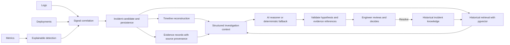
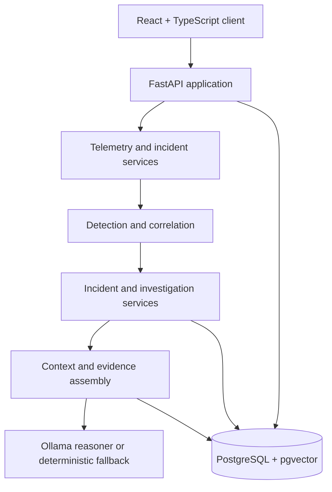

# IncidentIQ

## Evidence-first incident investigation and intelligence for software engineers

**Evidence before AI conclusion.** IncidentIQ connects fragmented engineering signals—metrics, logs, deployments, incident timelines, and historical incidents—into a structured workflow for investigating application incidents.

IncidentIQ is an **investigation and intelligence layer**. It is designed to work alongside observability and incident-management systems, not replace them. Its purpose is to help an engineer understand what the available evidence supports, inspect how that evidence is connected, and decide what to do next.

## The problem

During an incident, relevant information is distributed across telemetry, deployment history, alert context, and previous incident records. Engineers must reconstruct the sequence, distinguish coincidence from useful correlation, and decide which hypotheses merit further investigation. An alert or an AI-generated explanation alone does not provide that context or establish causality.

IncidentIQ makes the investigation path explicit: preserve source evidence, assemble it around an incident, retrieve potentially relevant history, and present a reviewable hypothesis with supporting evidence and uncertainty.

## Product vision and core principle

The goal is not to automate away engineering judgment. It is to reduce the work of collecting and connecting signals while keeping the reasoning inspectable.

> **Evidence before AI conclusion.**

Detection identifies unusual behavior. Correlation relates signals in time and service context. Investigation reasoning proposes explanations from a structured context. These are distinct operations, and none alone proves root cause. The human reviewer remains responsible for evaluating evidence and deciding whether to resolve the incident.

## End-to-end workflow

```text
DATA
  → DETECTION
  → CORRELATION
  → INCIDENT
  → RECONSTRUCTION
  → HISTORICAL RETRIEVAL
  → INVESTIGATION CONTEXT
  → AI / DETERMINISTIC REASONING
  → EVIDENCE VALIDATION
  → HUMAN DECISION
  → RESOLUTION
  → HISTORICAL KNOWLEDGE
```



## Explainable anomaly detection

IncidentIQ uses statistical detection over a historical metric baseline; it is not a deep-learning anomaly detector. The implementation calculates the baseline mean and standard deviation, median and median absolute deviation (MAD), standard z-score, robust z-score, and percentage deviation. It also evaluates persistence across recent observations before classifying a current observation as anomalous.

The result distinguishes three states:

| State               | Meaning                                                                                  |
| ------------------- | ---------------------------------------------------------------------------------------- |
| `NORMAL`            | The current observation does not meet the configured anomaly and persistence conditions. |
| `ANOMALY`           | Statistical deviation and the configured persistence requirement are satisfied.          |
| `INSUFFICIENT_DATA` | There are not enough historical observations to form a baseline.                         |

The detector handles zero standard deviation and zero MAD explicitly rather than dividing by zero. Its result includes the baseline statistics, scores, direction, method, persistence count, and a human-readable explanation so a downstream incident decision can be inspected.

## Signal correlation: detection is not root cause

An anomaly does not automatically become an incident. Correlation evaluates candidate signals using temporal proximity, service identity, telemetry-type relationships, and deployment proximity. The configured weighted score is accompanied by component scores, correlation level, time difference, and reasons. Incident formation consumes these results to decide whether the evidence forms an incident candidate.

**Detection ≠ correlation ≠ root cause.** Detection describes a metric against its baseline. Correlation describes relationships among signals. Neither establishes that one signal caused another.

## Incident management and reconstruction

Incident lifecycle states are `OPEN → INVESTIGATING → RESOLVED`. Investigation records move through `PENDING → RUNNING → COMPLETED`, with a `FAILED` state for unsuccessful runs. These state transitions are explicit and validated; a failed investigation is not represented as a completed result.

The investigation workspace brings together the incident, investigation state, a possible AI or deterministic hypothesis, supporting evidence, a reconstructed timeline, historical intelligence, and the eventual resolution. Engineers can inspect the underlying evidence before making a decision.

The timeline reconstructs metrics, logs, and deployments in temporal order within a configurable window around the detection point (10 minutes before and after by default). A simplified simulator sequence is:

```text
normal checkout latency
  → latency degradation
  → nearby deployment
  → payment timeout error
  → current anomalous latency observation
  → incident detected
```

Temporal order makes the sequence reviewable; it does not prove that the deployment caused the degradation.

## Evidence and provenance

Evidence provenance is a first-class part of the investigation model. Evidence records retain their source type and source identifier, allowing an engineer to move from a reasoning result to the evidence record and then to the original telemetry source.

```text
AI hypothesis
	→ supporting evidence IDs
	→ evidence records
	→ original metric, log, or deployment telemetry
```

AI output is validated against the investigation context: referenced evidence IDs must exist in that context, and a hypothesis must include supporting evidence. This makes unsupported or unrelated evidence references rejectable instead of allowing the model to silently invent a provenance chain.

## Historical intelligence and semantic retrieval

An engineer can explicitly convert a resolved incident into reusable historical knowledge, including a summary, symptoms, root cause, resolution, severity, service association, and timestamps. Resolution alone does not automatically create a historical record. The embedding workflow encodes this incident text with `all-MiniLM-L6-v2` into 384-dimensional vectors stored in PostgreSQL using pgvector. Retrieval ranks candidates by cosine similarity and can filter by project, service, result count, and similarity threshold.

> **Historical similarity provides context, not causal proof.**

A similar prior incident can suggest questions or useful comparisons. It cannot establish that the current incident has the same cause.

## RAG and context engineering

IncidentIQ does not send an unconstrained prompt such as “What caused this incident?” The application first assembles structured investigation context containing incident details, telemetry-backed evidence, a reconstructed timeline, deployment and log events, and retrieved historical incidents with similarity information. The reasoning engine receives this serialized context rather than querying operational tables independently.

```text
Evidence collection → Context engineering → Reasoning
```

This separation makes the information supplied to the reasoning layer inspectable and testable. Historical retrieval is contextual input, not a substitute for current incident evidence.

## AI investigation and reliability

The local AI path uses **Ollama** with **Qwen2.5 3B Instruct**. Its structured result contains a hypothesis, confidence, reasoning, supporting evidence IDs, alternative explanations, and next steps. The model receives only the prepared investigation context and is instructed not to invent telemetry, treat similarity as causality, or present a hypothesis as a confirmed root cause.

The correct interpretation is: **AI-generated hypothesis — not confirmed root cause.**

Model output is untrusted input. The implementation handles unavailable Ollama, empty responses, malformed JSON, schema-invalid output, and invalid confidence values. It validates supporting evidence against the context before accepting a result. If AI reasoning cannot be used, deterministic rule-based reasoning provides a fallback hypothesis, alternatives, and next steps from the available context. The fallback also describes uncertainty rather than claiming a confirmed cause.

This is an engineering boundary, not a promise that model output is always correct: the model proposes; validation checks structure and provenance; an engineer reviews the result.

## Production simulator: a real pipeline, controlled evidence

The canonical scenario is **“Bad Deployment Causes Checkout Latency Degradation.”** The simulator generates controlled evidence for a checkout service:

- 20 normal `checkout_latency` observations near 100 ms;
- deployment `v2.4.0`;
- five anomalous latency observations;
- a payment-timeout `ERROR` log; and
- a current anomalous latency observation.

The simulator submits the final metric to the same IncidentIQ incident pipeline used by the application. It does not implement a separate detector or decide whether an incident exists.

> **Simulation generates evidence. IncidentIQ decides whether that evidence constitutes an incident.**

### Failure injection, reset, and replay

The failure injection is a set of synthetic telemetry and deployment records, not a change to a real service. Reset removes records owned by the active simulation, including its generated telemetry and simulator-created incident-related records. The lifecycle is repeatable:

```text
Healthy
	→ Failure Injection
	→ Incident
	→ Investigation
	→ Resolution
	→ Reset
	→ Healthy
	→ Replay
	→ New Incident
```

This makes the same evidence-to-investigation path available for demonstration and regression testing.

## Product experience

The React application supports sign-in, a home/dashboard view, project selection, a project incident inbox, and a project-scoped investigation workspace. In the workspace, an engineer can review incident severity and lifecycle state, inspect a chronological timeline, create and run an investigation, inspect supporting telemetry, view similar historical incidents, and resolve the incident. A separate simulator screen demonstrates the controlled checkout failure, displays the resulting incident, and supports reset/replay.

The backend exposes project, service, telemetry, incident, timeline, investigation, evidence-inspection, historical-incident, retrieval, and simulation APIs. Requests use bearer-token authentication and project ownership checks. This is application-level, project-scoped access control—not enterprise IAM or SSO.

## Technical architecture

IncidentIQ is organized as a modular monolith with service boundaries for telemetry ingestion, detection, correlation, incident formation and persistence, timeline reconstruction, historical retrieval, context assembly, and reasoning. PostgreSQL is the system of record, including pgvector embeddings. The React client communicates with the FastAPI backend.



Redis and a small `BLPOP` worker scaffold are included for queue experimentation. The worker currently prints dequeued jobs; core detection, incident formation, and investigation are handled directly by backend services rather than delegated to a production job-processing system.

### Technology stack

| Area              | Technologies                                                                                                                                   |
| ----------------- | ---------------------------------------------------------------------------------------------------------------------------------------------- |
| Frontend          | React, TypeScript, Vite                                                                                                                        |
| Backend           | Python, FastAPI, Pydantic, SQLAlchemy, Alembic                                                                                                 |
| Data and queueing | PostgreSQL, pgvector, Redis                                                                                                                    |
| AI / ML           | Statistical anomaly detection, sentence-transformers, `all-MiniLM-L6-v2`, Ollama, Qwen2.5 3B Instruct, retrieval-augmented context engineering |
| Engineering       | Docker, Docker Compose, pytest, GitHub Actions                                                                                                 |

## Testing strategy

The project has unit, integration, and end-to-end tests, as well as focused failure-path and AI reliability tests. Separate suites exercise detection and correlation behavior, historical retrieval, investigation context, simulator behavior, and performance. The latest validated non-integration baseline in this workspace is:

**281 passed · 1 deselected · 0 failed**

The deselected test is excluded by the `not integration` marker used for that run; this count should not be read as a result for the full integration suite. Test coverage has previously reached 96% in a measured run; coverage can vary with the selected test set and is not a production-quality claim.

## Evaluation

Detection, correlation, retrieval, and investigation reliability have focused evaluation tests. The checked-in controlled synthetic detection benchmark contains **10 labeled cases** (five anomalous and five normal), and its current expected result is:

| Precision | Recall |   F1 | Accuracy |
| --------: | -----: | ---: | -------: |
|      1.00 |   1.00 | 1.00 |     1.00 |

This is a small, controlled synthetic benchmark—not production accuracy and not evidence of generalization to arbitrary workloads. Retrieval evaluation checks ranking behavior against known expected incidents. AI reliability tests exercise malformed, empty, unavailable, and invalid model responses, as well as evidence-reference validation.

## Performance baselines

The following are recorded **local development baselines**, not service-level objectives or production capacity claims. They depend on the host, data volume, database state, and test conditions.

| Operation               |         Local baseline |
| ----------------------- | ---------------------: |
| Telemetry ingestion     |        320.01 events/s |
| Detection               |    31,347 detections/s |
| Incident pipeline       |        114.04 events/s |
| Historical retrieval    |       479.08 queries/s |
| Deterministic reasoning | 511,624.52 reasoning/s |

These measurements describe individual benchmark runs and should be rerun under a documented environment before being used for capacity planning.

## Observability and CI

The application emits JSON-formatted request logs, records request counts/statuses/latency in process-local metrics, and exposes basic application, database, and Redis health endpoints. Docker Compose defines the local PostgreSQL/pgvector, Redis, backend, and frontend services. GitHub Actions runs backend test validation with PostgreSQL/pgvector and Redis services, plus frontend lint and production-build checks. These are development observability and CI foundations; they do not imply production monitoring or deployment.

## Important engineering decisions

| Decision                          | Rationale                                                                                                                                                                                                                                                           |
| --------------------------------- | ------------------------------------------------------------------------------------------------------------------------------------------------------------------------------------------------------------------------------------------------------------------- |
| Statistical detection             | Baselines, thresholds, persistence, and score components are inspectable and testable. A transparent detector is appropriate for this project’s controlled telemetry workflow; it avoids implying that an opaque model knows what “normal” means for every service. |
| Separate detection from reasoning | A statistical anomaly is a signal, not an incident explanation. Keeping detection, correlation, incident formation, and reasoning separate makes decisions easier to validate and prevents an LLM from becoming the detection authority.                            |
| pgvector for historical retrieval | It keeps embeddings beside the relational incident records and supports semantic similarity retrieval without introducing a separate vector database for the current scale.                                                                                         |
| Local AI through Ollama           | A local model makes the reasoning path reproducible and inspectable without requiring a hosted AI API or sending incident context to an external model provider.                                                                                                    |
| Deterministic fallback            | Investigation remains available when the local model is unavailable or its output fails validation. The fallback is predictable and evidence-aware, while still presenting its output as a hypothesis.                                                              |
| Modular monolith                  | Detection, incident workflows, retrieval, and reasoning share domain data and are actively evolving. Explicit service boundaries provide separation without the operational overhead and distributed failure modes of premature microservices.                      |
| Evidence provenance               | An explanation is only useful for review if its supporting evidence can be followed back to telemetry. Evidence IDs and context validation make that relationship explicit and reject ungrounded references.                                                        |

## Product and AI boundaries

IncidentIQ is **not**:

- a replacement for Datadog, Splunk, Grafana, or PagerDuty;
- an autonomous remediation platform;
- a generic AI chatbot; or
- a guaranteed root-cause detector.

It is an incident investigation and intelligence layer that organizes available signals and offers evidence-backed investigative hypotheses for human review. AI confidence is a model estimate, not a calibrated probability that the explanation is true.

## Current limitations

- The production simulator is controlled synthetic telemetry, not a live service or a representative workload.
- Historical retrieval and performance have been exercised at development/test scale; large-corpus throughput and indexing behavior are not claimed here.
- AI-backed investigation depends on a locally available Ollama service and the configured model; deterministic reasoning is a fallback, not equivalent generative analysis.
- Evaluation datasets are controlled and limited. Benchmark results do not establish production accuracy.
- External observability-platform integrations are not currently provided.
- Authentication and authorization are project-scoped application controls, not enterprise IAM or SSO.
- There is no automated remediation; engineers remain in the decision loop.
- Public production deployment is not complete.

## Future extensions

Potential future scope includes external observability integrations, hybrid lexical and semantic retrieval, larger-scale vector indexing, a richer investigation graph, broader and more realistic evaluation datasets, carefully gated automated remediation, and a production deployment with operational controls. These are extensions, not current capabilities.

## Canonical demo

The demo starts with a healthy checkout service, injects the bad-deployment scenario, and follows the resulting evidence through the actual IncidentIQ pipeline:

```text
Healthy system
  → Deploy Bad Version
  → Telemetry changes
  → Detection
  → Correlation
  → Incident
  → Timeline
  → Historical Retrieval
  → AI Investigation
  → Evidence Inspection
  → Resolution
  → Reset
  → Replay
```

The reviewer can trace a hypothesis back to its supporting evidence, inspect alternatives and next steps, and decide whether the incident is ready to resolve. For the repeatable walkthrough, see the [Demo Runbook](docs/demo-runbook.md).

## The engineering story

IncidentIQ is a systems and applied-AI project built around a practical constraint: an incident explanation must remain reviewable. It combines statistical detection, weighted signal correlation, persisted incident lifecycles, temporal reconstruction, vector retrieval, structured context engineering, local language-model reasoning, deterministic fallback, and evidence-reference validation.

The central design choice is to keep evidence, correlation, and hypothesis separate. That separation makes the pipeline testable, makes AI behavior bounded by the context supplied to it, and gives engineers a path from a proposed explanation back to the telemetry that informed it. The result is not an autonomous operator; it is a repeatable investigation workflow designed to help an engineer make a better-informed decision.
